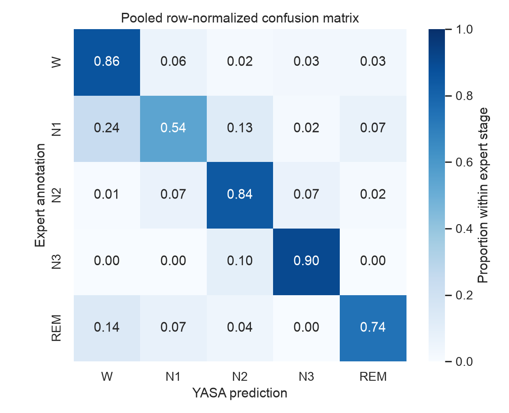

# Sleep-EEG staging evaluation

Automatic sleep staging is useful, but a single accuracy value does not show where the model fails. In this project I compare YASA sleep-stage predictions with expert annotations from the open Sleep-EDF Expanded dataset. I also started a second analysis of EEG spectral power across the expert-scored stages.

## First results

The first run includes two recordings and 1,944 scored 30-second epochs. Pooled accuracy was 0.814, balanced accuracy 0.779, Cohen's kappa 0.750, and macro F1 0.770. N1 was the most difficult stage (F1 = 0.511).

These two recordings were enough to check the pipeline and find the main disagreement pattern, but they are not a population sample.



## Research questions

1. How well does YASA reproduce expert-scored Wake, N1, N2, N3, and REM stages, and which stages account for most disagreement?
2. How does relative delta, theta, alpha, sigma, and beta power differ across expert-annotated sleep stages in a public whole-night recording?

## Status

The two-recording staging run is complete. The spectral code is implemented and tested, but I have not yet reviewed and added its generated results. The next staging step is to fix the larger sample before looking at its pooled metrics.

The full numbers are in [the first results note](docs/mvp_results.md). The spectral method is described [separately](docs/spectral_analysis.md).

## Data

I use Sleep-EDF Database Expanded, PhysioNet, version 1.0.0. The scripts download the EDF files directly from PhysioNet; the raw recordings are not stored in this repository.

## Main analysis choices

- The original EDF files are not changed.
- Expert annotations and predictions are aligned by 30-second epoch onset.
- The evaluation window keeps sleep plus 30 minutes of Wake on either side. This prevents the long periods of easy edge Wake from inflating accuracy.
- Movement and unscored epochs are excluded from performance metrics.
- Stage 4 annotations from the historical Rechtschaffen and Kales system are merged into N3 for the five-stage comparison.

## Project structure

```text
src/                 Analysis code
results/             Reviewed staging outputs; ignored spectral outputs
docs/                Protocol, methods, results, and limitations
data/                 Downloaded source data (never committed)
.github/workflows/   Automated test workflow
```

## Run the staging analysis

```bash
python -m venv .venv
source .venv/bin/activate
pip install -r requirements.txt
python src/run_mvp.py --subjects 0 1 --recording 1 --output-dir results --data-dir data
python src/make_figures.py --results-dir results
```

On macOS, LightGBM also requires OpenMP (`brew install libomp`). The first analysis command downloads approximately 100 MB of source EDF files from PhysioNet.

To run the unit tests, install `requirements-dev.txt` and use `python -m pytest`.

## Run the spectral analysis

```bash
python src/spectral_analysis.py \
  --subject 0 \
  --recording 1 \
  --data-dir data \
  --output-dir results/spectral/sub-00-night-1
```

This command downloads the requested recording, creates 30-second expert-labelled epochs, estimates 0.5–30 Hz Welch spectra, and writes CSV, JSON, and PNG results.

## Sources

- PhysioNet Sleep-EDF Expanded: https://physionet.org/content/sleep-edfx/1.0.0/
- YASA: https://github.com/raphaelvallat/yasa
- MNE-Python: https://mne.tools/
