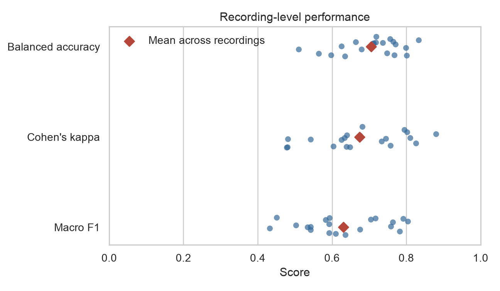
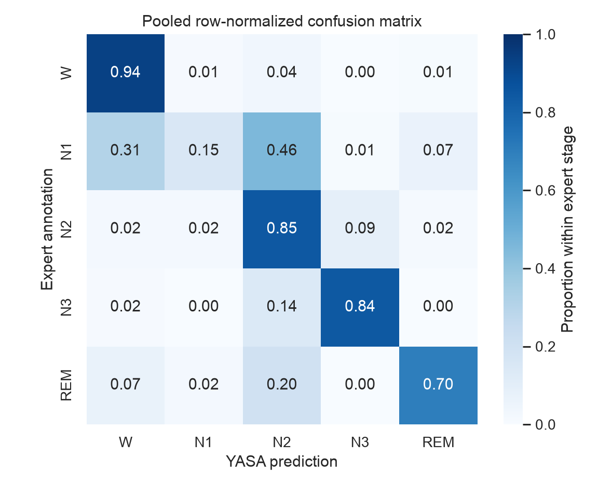
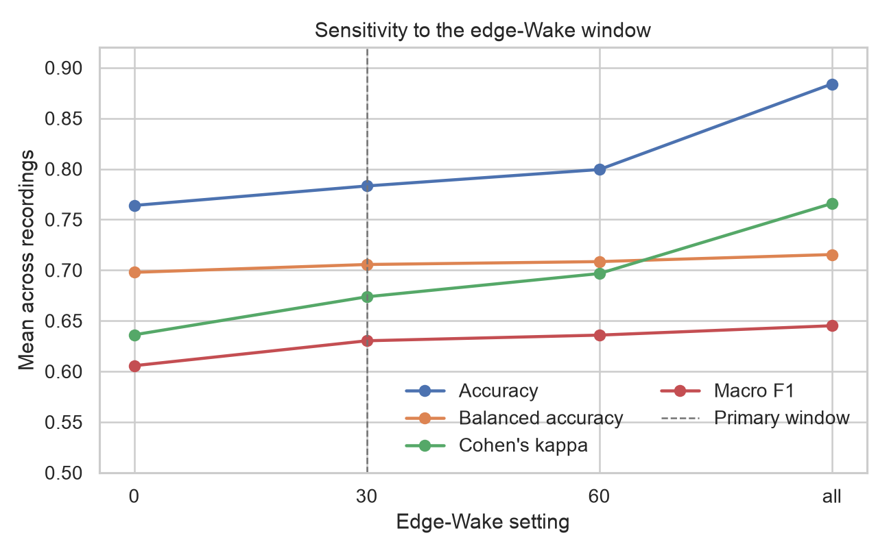

# Results for 20 Sleep-EDF recordings

I evaluated the YASA five-stage classifier on the 20 recordings listed in the [analysis protocol](evaluation_protocol_v0_1.md). Subjects 0 and 1, which I had already used while checking the code, were kept out of this analysis.

All selected recordings finished successfully. The main 30-minute edge-Wake window contained 28,259 aligned 30-second epochs.

## Results across recordings

Each recording contributes one value to the table below. The intervals were calculated by resampling the 20 recordings 2,000 times.

| Metric | Mean | SD | 95% bootstrap interval |
|---|---:|---:|---:|
| Accuracy | 0.783 | 0.080 | 0.749–0.819 |
| Balanced accuracy, stages present in the recording | 0.706 | 0.084 | 0.670–0.742 |
| Macro recall, fixed five stages | 0.678 | 0.106 | 0.634–0.724 |
| Cohen's kappa | 0.674 | 0.120 | 0.623–0.727 |
| Macro F1, fixed five stages | 0.630 | 0.114 | 0.581–0.683 |

Four recordings had no expert-scored N3. Balanced accuracy over the stages actually present in a recording does not penalize this. Fixed-five-stage macro recall and macro F1 assign zero to the absent N3, which is why their means are lower. Both versions are reported rather than hiding this choice inside one number.

Balanced accuracy ranged from 0.510 to 0.833 between recordings. The fixed-five-stage macro recall ranged from 0.508 to 0.833, and Cohen's kappa from 0.478 to 0.880.

For comparison, pooling all epochs gave accuracy 0.786, five-stage macro recall 0.696, Cohen's kappa 0.692 and macro F1 0.671. The recording-level table remains the main summary because thousands of epochs from one night are not thousands of independent participants.

## Stage-level disagreement

| Stage | Precision | Recall | F1 | Expert epochs |
|---|---:|---:|---:|---:|
| Wake | 0.872 | 0.936 | 0.903 | 10,526 |
| N1 | 0.523 | 0.155 | 0.239 | 3,116 |
| N2 | 0.757 | 0.846 | 0.799 | 9,889 |
| N3 | 0.538 | 0.840 | 0.656 | 1,346 |
| REM | 0.823 | 0.703 | 0.758 | 3,382 |

N1 was the clear weak point. Only 15.5% of expert N1 epochs were labelled N1 by YASA. Most were labelled N2 (45.5%) or Wake (31.2%).

## Edge-Wake check

| Wake kept on each side | Accuracy | Balanced accuracy, present stages | Macro recall, five stages | Kappa | Macro F1 |
|---:|---:|---:|---:|---:|---:|
| 0 min | 0.764 | 0.698 | 0.670 | 0.636 | 0.606 |
| 30 min | 0.783 | 0.706 | 0.678 | 0.674 | 0.630 |
| 60 min | 0.799 | 0.708 | 0.681 | 0.697 | 0.636 |
| All scored Wake | 0.884 | 0.715 | 0.688 | 0.766 | 0.645 |

Keeping all scored Wake increased ordinary accuracy by about 0.10. The two recall summaries changed by about 0.01. This is why the amount of Wake was fixed before the main run and why ordinary accuracy is not used alone.

## Checks and limits

- Every expert epoch in the analysis window had exactly one prediction at the same 30-second index.
- No selected subject was replaced after the results were seen.
- The classifier uses Fpz-Cz EEG and horizontal EOG in this Sleep-EDF subset.
- EMG, age and sex were not supplied to the classifier.
- The selected subjects had a mean age of 62.9 years (range 25--101); 13 were female and 7 male.
- Sleep-EDF uses historical R&K scoring rather than current AASM scoring; stages 3 and 4 were combined as N3.
- YASA was evaluated as distributed. Its current package loads a label encoder saved with an older scikit-learn version and prints a known compatibility warning ([YASA issue #157](https://github.com/raphaelvallat/yasa/issues/157)). Stage labels, counts and alignment were checked after the run.
- These results describe this public sample and this packaged YASA model. They are not a clinical validation.

The underlying tables and run metadata are in [`results/evaluation_v0_1`](../results/evaluation_v0_1). The metadata records the sample, input filenames and checksums, classifier inputs, metric definitions, source hashes and exact package versions.
