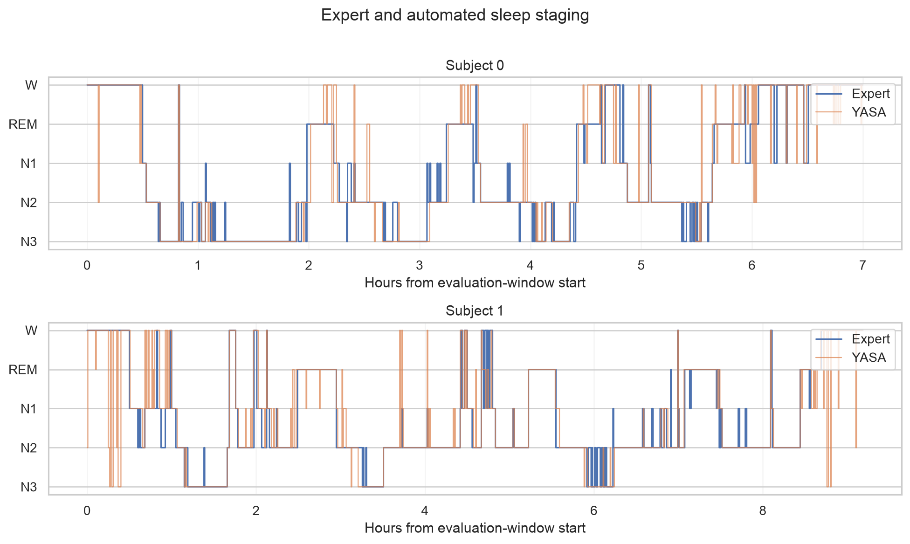

# First staging results

## Scope

I first ran the complete pipeline on two Sleep-EDF recordings. The aim was to check whether the code could load the data, generate YASA predictions, align them with expert labels, calculate the metrics, and produce readable figures.

## Analysis window and sample

The analysis used recording 1 for Sleep-EDF age-study subjects 0 and 1. To prevent the long periods of edge wakefulness in the original recordings from inflating accuracy, each record was restricted to the interval from 30 minutes before the first expert-scored sleep epoch through 30 minutes after the last expert-scored sleep epoch.

This retained 841 scored epochs for subject 0 and 1,103 for subject 1 (1,944 epochs total). It excluded 1,809 and 1,699 edge-Wake epochs, respectively. Each retained epoch represents 30 seconds.

## Results

| Subject | Scored epochs | Accuracy | Balanced accuracy | Cohen's kappa | Macro F1 |
|---:|---:|---:|---:|---:|---:|
| 0 | 841 | 0.785 | 0.697 | 0.716 | 0.706 |
| 1 | 1,103 | 0.837 | 0.837 | 0.769 | 0.799 |
| Pooled | 1,944 | 0.814 | 0.779 | 0.750 | 0.770 |

Pooled stage-specific F1 scores were 0.816 for Wake, 0.511 for N1, 0.872 for N2, 0.855 for N3, and 0.795 for REM. N1 was the principal weakness: only 54.5% of expert N1 epochs were predicted as N1, with Wake the most common alternative prediction.

## Checks

- All four source-file SHA-1 values matched the checksums supplied by MNE's Sleep-EDF registry.
- Expert annotations mapped exactly to 30-second epoch indices.
- There were no duplicate aligned epochs, missing values, or unexpected stage labels.
- Stage counts and the start and end of each evaluation window were inspected separately for both subjects.
- The pooled confusion matrix and both paired hypnograms were visually inspected.

## Limitations

- Two subjects are enough to check the code, but not to estimate performance in a population.
- Epochs from the same night are not statistically independent; no confidence intervals or hypothesis tests are reported.
- Sleep-EDF uses historical Rechtschaffen and Kales scoring. Stages 3 and 4 were combined as N3 for the five-stage comparison.
- Performance is specific to the available Fpz-Cz EEG and horizontal EOG channels and the packaged pretrained YASA model.
- YASA 0.7 loads a model serialized with an older scikit-learn LabelEncoder, which produces a version warning in the current environment. Outputs passed label, alignment, and distribution checks, but the warning should be resolved or documented again before an archival release.

## Next milestone

Choose a larger subset before looking at its pooled results, add tests for alignment and edge-Wake handling, and record the complete software environment for a versioned release.
